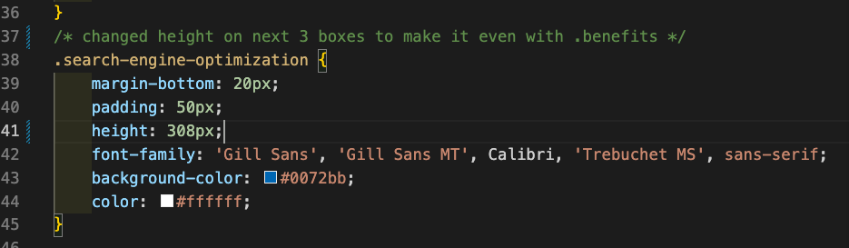

# Refactor-Marketing-Site

## Technology used

-[HTML](https://www.w3schools.com/html/html_elements.asp)
-[CSS](https://www.w3schools.com/css/default.asp)


## Live site 
https://lauriefish22.github.io/refactor-marketing-site/
## Github 
https://github.com/lauriefish22/refactor-marketing-site

## Contact
Laurie Fish
iamlauriefish@mgmail.com

## Description

The goal of this website refactor was to optimize the site for SEO and to clean up any code that is not working and/or not using semantic HTML.  All links and function will be adjusted if needed to create a clean, functioning website that is useful to the user and show clean code to help any additional programmers in the future.  Comments will be present to clearly show the reason for the adjustments to provide any clarification needed.  

## Intention of Project
*Optimize the site for search engines
*Ensure elements follow a logical structure within HTML and CSS
*Descriptive titles, headers and images that show the product including alt attributes
*Site is visually appealing

## Learning Points
Using consistent semantic HTML makes adjustments and debugging easier for everyone and making sure comments are used to provide other collaborators the reason why.  These help the user and the collaborator's experience with the site a positive one. 


## Adjustments in CSS to make the site more visually appealing 

## Before and after pics of adjusting the color


## Before and after pics of adjusting box height 





## Example of changing to semantic HTML for clarity

## I changed many of the divs to a more appropriate names for the elements

```
<!-- changed <div> to <aside> for clarity -->
    <aside class="benefits">

<!-- changed <div> to <footer> for clarity -->
    <footer class="footer">
        <h2>Made with ❤️️ by Horiseon</h2>
        <p>
            &copy; 2019 Horiseon Social Solution Services, Inc.
        </p>
    </footer>```


